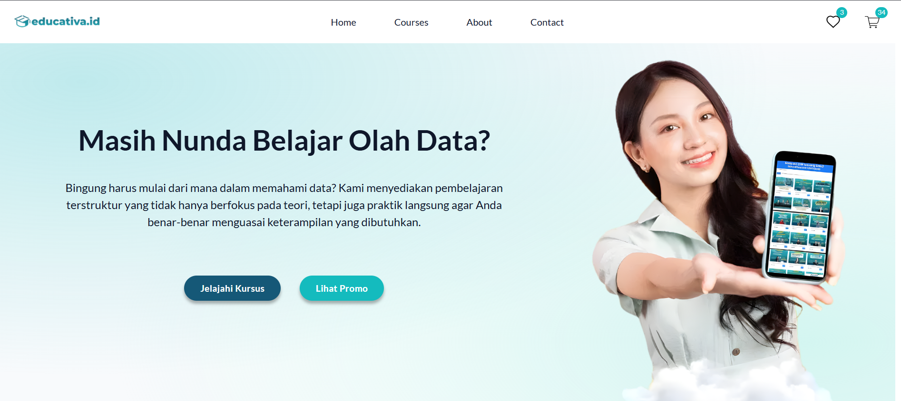
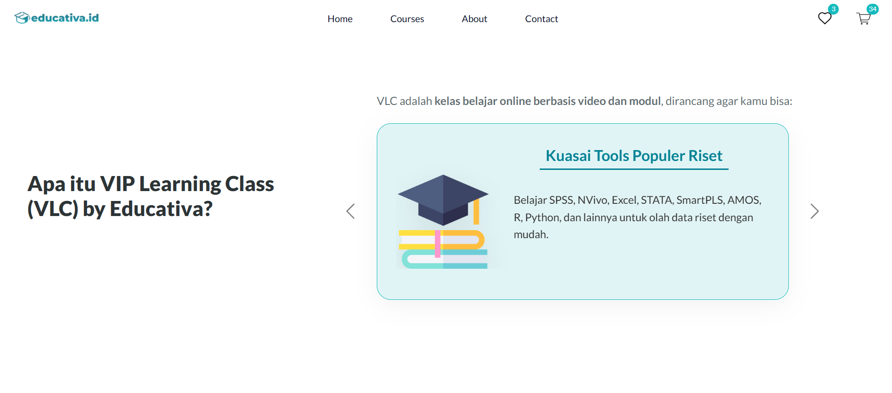
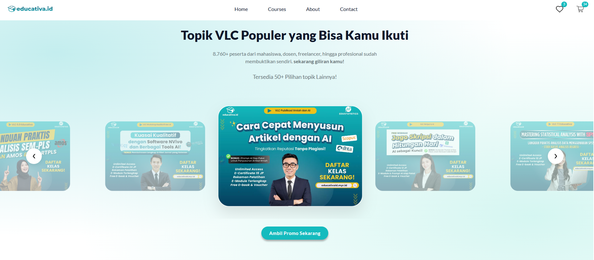
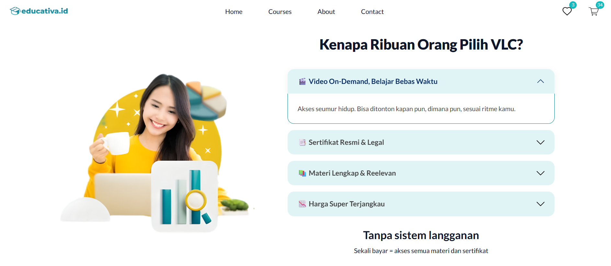
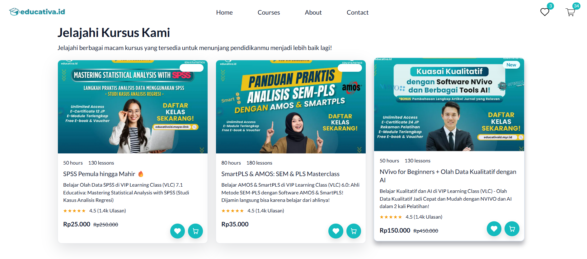

# EduClass – Educativa Indonesia

### 📌 Deskripsi Utama

EduClass adalah platform pembelajaran online yang berfokus pada **olah data, riset, dan pengembangan skill akademik maupun profesional**. Dirancang dengan tampilan modern dan interaktif untuk membantu pengguna belajar secara lebih **praktis, terstruktur, dan fleksibel** tanpa bergantung pada pembelajaran konvensional.

---

## Live Preview

> https://revanyangel.github.io/EduClass-Educativa/

  

    
    
  

  

    
    
  

  

    
  

---

### 🚀 Fitur Utama

* **Navigation**
  Navbar interaktif yang dilengkapi wishlist dan cart counter.

* **Hero Section (Call-to-Action)**
  Tampilan awal yang menarik dengan CTA untuk mengarahkan user menjelajahi kursus.

* **VLC Carousel (VIP Learning Class)**
  Carousel berbasis Bootstrap yang menampilkan keunggulan utama kelas seperti:

  * Belajar praktis
  * Sertifikat resmi
  * Penguasaan tools riset populer

* **Poster Carousel (Custom Slider)**
  Slider interaktif dengan efek scaling untuk menampilkan topik kursus populer.

* **Accordion Informasi**
  Menyajikan alasan memilih VLC dengan tampilan clean dan animasi smooth.

* **Courses Grid**
  Menampilkan daftar kursus dalam bentuk card modern dengan efek hover.

* **Promo Modal**
  Popup interaktif untuk menampilkan informasi promo kepada pengguna.

---

### 🛠️ Teknologi yang Digunakan

* **HTML5** → Struktur utama website
* **CSS3** → Styling, layout, dan animasi (Flexbox, Grid, CSS Variables)
* **Bootstrap 5** → Komponen UI seperti carousel & accordion
* **Vanilla JavaScript** → Interaktivitas (carousel custom, modal, dynamic content)

---
